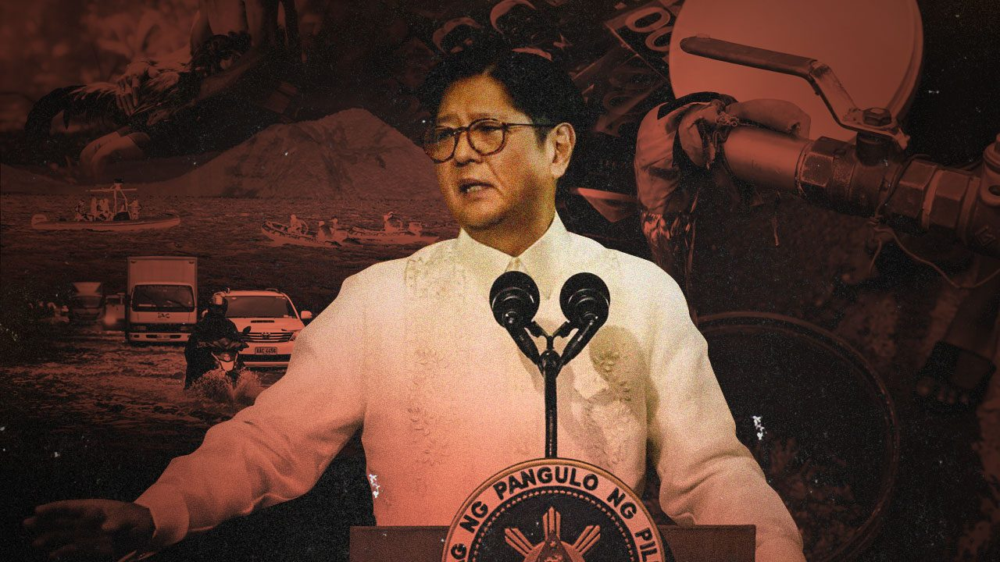

# **Take on SONA July 2025 of Pres. Ferdinand R. Marcos Jr.**
### By: Carlessa Christiana G. Castañeda, 9-Sodium

## **1. Key points that I found interesting:**
* His plan to implement 200 energy plants for electricity in the next 3 years.

* His plan to construct 1 million homes with solar power by the end of 2028.

* The governments plan to publish a list of all the flood projects that were successful, defective and suspected to be ghost projects from the last 3 years.

## **2. Key point I found weird:**
* The fact he said we can sell rice for P20 without our farmers having major losses, I'm very skeptical of his statement especially when Kiko Pangilinan himself said that this can't be sustainable.

## **3. My reflection essay:**
After watching SONA 2025, I can say I have very mixed feelings.  I'm not surprised that he would make promises on what he plans to change during the rest of his term, but it's rather hard to believe when it's coming from BBM. There were many points I found interesting, but also weird. Like the fact BBM still can't let go of his P20 rice. All of the promises he made are definitely things I would like to see in the future of our country, but I doubt they could be realistically implemented in the next 3 years.

These are things I would love to see for our country, such as free healthcare for all, focusing on bettering the production of local products, and lowering inflation. But I'm rather skeptical of how they'll be funded, I find it rather hard to believe we can sustainably fund and continue to support these projects moving into the future.

The major thing that surprised me while watching the SONA was his take on corruption. "Mahiya naman kayo." is what he said, pointing out that the government would file charges against those guilty of defective/ghost projects. I wasn't expecting BBM to state his stance on it, especially when he's coming from the Marcos lineage, and the very questionable figures are likely in the audience applauding him during the standing ovation. I can only hope that his words are more than empty promises, and I'm curious to see how many of these projects are actually implemented.

## **My reaction after hearing SONA 2025:**
sinabi mo yan ah... 

photo from: Salgado, J. (2025b, July 29). [Rear View] In his 4th SONA, Marcos introduces the nation to the new ‘kontrabidas’ RAPPLER. https://www.rappler.com/voices/thought-leaders/rear-view-marcos-introduces-new-villains-sona-2025/